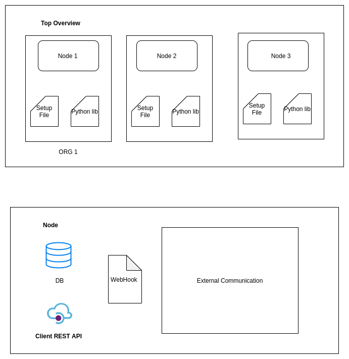

## If You Are using virtual env please use venv as folder name or add your env name to .gitignore

blockchain folder conatain all blockchain realted files

client folder contains client related files


## Docker Commands
```bash
1. To Build Image
$ docker image build -t simple_blockchain .

2. To run
$ docker run  --net=host simple_blockchain $port
Please change $PORT accordingly

3. To Stop Container and Remove
$ docker stop $(docker ps -q -a)
$ docker rm $(docker ps -q -a)
```

## Explanation




